# 02 — Escopo Ágil

> O backlog é organizado em **épicos → histórias → critérios de aceite** (Given/When/Then). Cada iteração entrega um **incremento vertical testável**. A ordem segue o peso da avaliação e as dependências técnicas.

## 1. Princípios

- **Correção antes de feature:** nenhuma história é "pronta" sem o teste que prova sua invariante.
- **TDD:** teste vermelho → implementação mínima → refatoração (ver [04-estrategia-testes.md](./04-estrategia-testes.md)).
- **Fatia vertical:** cada iteração termina com `docker compose up` funcional e testes verdes.
- **Timebox consciente:** autenticação e diferenciais só entram depois do núcleo (MoSCoW).

## 2. Definition of Ready (DoR)

Uma história só entra na iteração se tiver:
- critérios de aceite em Given/When/Then;
- invariantes afetadas identificadas (ver [01 §4](./01-analise-requisitos.md#4-invariantes-globais-o-que-nunca-pode-quebrar));
- decisões ambíguas resolvidas e registradas.

## 3. Definition of Done (DoD)

- [ ] Testes escritos **antes** do código (commit do teste vermelho visível no histórico quando fizer sentido)
- [ ] `bun test` verde (unidade + integração afetada)
- [ ] `bun run lint` e `bun run typecheck` (TS `strict`) sem erros
- [ ] Constraints de banco cobrindo a invariante, com migration `up/down`
- [ ] Logs estruturados e métricas da funcionalidade
- [ ] `ARCHITECTURE.md` atualizado se houve decisão
- [ ] Invariante final verificada: `wallet.balance == saldo reconstruído pelo ledger`

## 4. Priorização (MoSCoW)

Revisada após a análise de conformidade ([07-conformidade.md](./07-conformidade.md)): **todo o obrigatório do enunciado vem antes de qualquer diferencial**.

| Prioridade | Itens |
|---|---|
| **Must** (pontuam no §14) | Money, Wallet, ledger, transações e regras, idempotência, concorrência, inbox, outbox, SQS + DLQ, worker de pendências com backoff/limite (§7.1), reconciliação, health, **métricas obrigatórias do §12** (`/metrics`), logs estruturados, testes obrigatórios do §13, README/ARCHITECTURE |
| **Should** | Trilha de auditoria (sustenta o "auditável" da regra 9 e do §6.3), graceful shutdown completo, cursor opaco no ledger, problem details, `PlayerSessionPolicy` no-op |
| **Could** (diferenciais, só após o Must) | Teste de carga (`test:load`), OpenTelemetry + Grafana, e-mail de incidente, alertas antifraude, retenção de inbox/outbox, conexão de leitura separada, teste de escala 1×3, ledger double-entry |
| **Won't (agora)** | Autenticação real com IdP (fica `AuthGuard` no-op + desenho documentado), reversão parcial, multi-moeda com escalas diferentes de 2, Kubernetes |

## 5. Épicos e histórias

Estimativa em *story points* (Fibonacci). Prefixo da história = épico.

### E0 — Fundação do projeto
| ID | História | Pts |
|---|---|---|
| E0-1 | Como dev, quero o projeto NestJS rodando em Bun com TS `strict`, lint e formatação | 2 |
| E0-2 | Como dev, quero `docker compose up` subindo Postgres, LocalStack (filas criadas) e a aplicação | 3 |
| E0-3 | Como dev, quero MikroORM configurado com migrations reversíveis | 3 |
| E0-4 | Como dev, quero a infraestrutura de testes de integração com Testcontainers (Postgres + LocalStack) | 3 |
| E0-5 | Como operador, quero logs JSON com `correlationId` desde o primeiro endpoint | 2 |

**Aceite E0-2:** *Given* um clone limpo, *When* rodo `docker compose up -d`, *Then* `GET /health/ready` responde `200` e as filas `wager-transactions.fifo`, `wager-transactions-dlq.fifo` e `wagering-events.fifo` existem.

### E1 — Núcleo de domínio (puro, sem framework)
| ID | História | Pts |
|---|---|---|
| E1-1 | `Money` imutável, exato, 2 casas, multi-moeda, validação de entrada | 3 |
| E1-2 | `Wallet` (aggregate root) com `debit/credit` gerando o lançamento do ledger | 5 |
| E1-3 | `WagerTransaction` com máquina de estados e estados terminais | 5 |
| E1-4 | `WalletLedgerEntry` imutável com aritmética validada | 2 |
| E1-5 | Política de referência (`ReferencePolicy`): mesmo provider/player/wallet/moeda/rodada, kind permitido, valor igual, reversão única | 5 |
| E1-6 | `InboxMessage`, `OutboxMessage` e `IntegrationEvent` (classe abstrata + 4 subclasses) | 3 |

**Aceite E1-2:** *Given* wallet com `100.00 BRL`, *When* `debit(80.00)`, *Then* saldo `20.00`, `version` 2 e um lançamento `DEBIT` com `before 100.00 / after 20.00`; *When* `debit(30.00)` em seguida, *Then* lança `InsufficientFundsError` e o estado não muda.

### E2 — Wallets (persistência + API)
| ID | História | Pts |
|---|---|---|
| E2-1 | Schema `wallets`, `wager_transactions`, `wallet_ledger_entries` com todas as constraints | 5 |
| E2-2 | `POST /wallets` com `OPENING` atômico | 3 |
| E2-3 | `GET /wallets/:id` e `GET /wallets/:id/ledger` com cursor opaco | 3 |
| E2-4 | `POST /wallets/:id/reconciliation` com métrica e log de divergência | 3 |
| E2-5 | Conexão de leitura separada (`DATABASE_READ_URL`) para ledger, reconciliação, notificador e Grafana; *read-your-writes* no primário | 2 |

**Aceite E2-2:** *Given* um `playerId` sem wallet BRL, *When* `POST /wallets` com `1000.00`, *Then* `201`, `version 1`, existe uma transação `OPENING PROCESSED` e um `CREDIT 1000.00`; *When* repito, *Then* `409 WALLET_ALREADY_EXISTS`. Na mesma transação SQL, a outbox recebe `WagerTransactionProcessed` (do `OPENING`) e `WalletBalanceChanged` (§11: "qualquer transação aplicada"); com saldo inicial `0.00`, nenhum lançamento e nenhum `WalletBalanceChanged`.

### E3 — Processamento de transações (HTTP)
| ID | História | Pts |
|---|---|---|
| E3-1 | Use case `ProcessWagerTransaction` com lock pessimista por wallet | 8 |
| E3-2 | Idempotência: `payloadHash` canônico, replay fiel, conflito | 5 |
| E3-3 | `POST /wagering/transactions` com mapeamento HTTP consistente | 3 |
| E3-4 | `BET`, `WIN`, `LOSS` | 3 |
| E3-5 | `REFUND` e `ROLLBACK` por **um único fluxo de reversão** (`ReverseTransaction`), parametrizado por kind | 5 |
| E3-6 | Consultas de transação (id interno e id do provedor) | 2 |
| E3-7 | Cenário obrigatório: duas `BET 80.00` simultâneas sobre `100.00` | 3 |
| E3-8 | Como auditor, quero a linha do tempo imutável de cada transação (decisões, retries, replays, conflitos, lançamento gerado, reversão relacionada) | 5 |
| E3-9 | Porta `PlayerSessionPolicy` (no-op) chamada antes de cada `BET` + `playerId` validado como UUID no contrato | 1 |

**Aceite E3-5:** *Given* uma `BET` processada, *When* chegam `REFUND` e `ROLLBACK` dela (em qualquer ordem ou em paralelo), *Then* a primeira é `PROCESSED` com um `CREDIT`, a segunda é `REJECTED REFERENCE_ALREADY_REVERSED` com `relatedTransactionId` apontando a primeira, e o saldo é creditado uma única vez.

**Aceite E3-8:** *Given* uma `BET` que foi aplicada, reenviada 2× e depois revertida, *When* consulto `GET /wagering/transactions/:id/audit`, *Then* vejo em ordem: `PROCESSED` (com `ledgerEntryId`), 2× `IDEMPOTENT_REPLAY` e `REVERSED_BY` (com a transação de reversão), cada um com origem (HTTP/SQS/WORKER), `correlationId` e instância; e *When* tento `UPDATE`/`DELETE` na tabela de auditoria, *Then* o banco recusa.

**Aceite E3-7:** *Given* saldo `100.00`, *When* duas `BET 80.00` (keys diferentes) em paralelo, *Then* exatamente uma `PROCESSED`, outra `REJECTED INSUFFICIENT_FUNDS`, saldo `20.00`, um único `DEBIT`.

### E4 — Outbox e eventos
| ID | História | Pts |
|---|---|---|
| E4-1 | Eventos gravados na outbox na mesma transação SQL | 3 |
| E4-2 | Publisher com claim por lease (`FOR UPDATE SKIP LOCKED`), backoff e `SendMessageBatch` | 5 |
| E4-3 | Recuperação: processo morre após commit e antes de publicar → outra instância publica | 3 |
| E4-4 | Job de retenção de inbox processada e outbox publicada (> 7 dias, em lotes); ledger e auditoria intocáveis | 2 |

### E5 — Consumo SQS
| ID | História | Pts |
|---|---|---|
| E5-1 | Consumidor com inbox persistente na mesma transação | 5 |
| E5-2 | Classificação de erro: negócio (ack) / transitório (backoff) / permanente (DLQ) | 5 |
| E5-3 | Limite de tentativas + redrive para DLQ | 2 |
| E5-4 | Graceful shutdown em `SIGTERM` (drena ou devolve visibilidade) | 3 |

**Aceite E5-1:** *Given* uma mensagem já processada, *When* ela é reentregue, *Then* nenhum efeito novo, contador `duplicates_detected_total` incrementa e a mensagem é removida da fila.

### E6 — Referências fora de ordem
| ID | História | Pts |
|---|---|---|
| E6-1 | Persistir `PENDING_REFERENCE` + evento | 2 |
| E6-2 | Worker agendado com backoff exponencial e lease | 5 |
| E6-3 | Expiração: `REJECTED REFERENCE_NOT_FOUND` + evento | 2 |

### E7 — Observabilidade e operação
| ID | História | Pts |
|---|---|---|
| E7-1 | Métricas obrigatórias do §12 (`/metrics`), **incrementais a partir da I3**: status, duplicatas, retries, DLQ, conflitos de lock, outbox lag, latência | 3 |
| E7-2 | `GET /health/live` e `/health/ready` | 1 |
| E7-3 | Redaction de dados sensíveis nos logs | 1 |
| E7-4 | Instrumentação OpenTelemetry (traces por use case + métricas de negócio do catálogo) | 5 |
| E7-5 | Perfil `observability`: `otel-lgtm` + Alloy + `postgres-exporter` + Mailpit, com dashboards "Operação" e "Auditoria financeira" provisionados | 5 |
| E7-6 | Alertas no Grafana Alerting com três níveis (crítico/médio/leve) e políticas de envio, incluindo atraso, gargalo e aumento de fila | 3 |

| E7-7 | Como operador, quero receber por e-mail um relatório de incidente com análise, último cliente afetado, impacto, atraso, gargalo provável, filas, desfecho e nível (crítico/médio/leve) | 8 |
| E7-8 | Runbook por alerta em `docs/runbooks/` (linkado no e-mail) | 2 |
| E7-9 | Alertas antifraude por SQL na auditoria: velocidade de reversões por jogador e apostas em jogos simultâneos | 2 |

**Aceite E7-7:** *Given* 3 instâncias rodando, *When* forço uma mensagem para a DLQ, *Then* chega ao Mailpit um e-mail "[🟠 MÉDIO] DLQ recebendo — INC-n (DISPARADO)" com o último cliente afetado (`playerId` mascarado), o desfecho "mensagem na DLQ, transação não aplicada", a profundidade das filas e o link do runbook; *When* o Grafana reenvia o mesmo alerta, *Then* nenhum e-mail duplicado; *When* o alerta resolve, *Then* chega o e-mail "[RESOLVIDO]" com a duração.

**Aceite E7-6:** *Given* um clone limpo sem `.env`, *When* `docker compose --profile observability up` e forço uma mensagem para a DLQ, *Then* o alerta "DLQ recebendo" dispara e o e-mail aparece no Mailpit (`localhost:8025`); *When* defino `SMTP_*` no `.env`, *Then* o mesmo alerta chega pelo SMTP real.

### E8 — Testes de resiliência e carga
| ID | História | Pts |
|---|---|---|
| E8-1 | Suíte de concorrência com 3 processos reais | 5 |
| E8-2 | Testes de crash (fault injection após commit / antes do ack) | 5 |
| E8-3 | `bun run test:load` (k6) com relatório honesto | 5 |
| E8-4 | Teste de escala horizontal (ST-08): 1 × 3 instâncias, ganho e ponto de saturação | 3 |

### E9 — Documentação e autenticação (extensão)
| ID | História | Pts |
|---|---|---|
| E9-1 | `README.md` com setup e comandos | 1 |
| E9-2 | `ARCHITECTURE.md` com decisões, trade-offs e limitações | 3 |
| E9-3 | `AuthGuard` no-op + `ProviderIdentityPort` + desenho com Keycloak documentado | 1 |

## 6. Plano de iterações

Total estimado: ~177 pts (≈140 obrigatórios + ≈37 de diferenciais). As iterações são incrementos, não datas — a cadência real depende da disponibilidade.

```mermaid
gantt
    dateFormat X
    axisFormat %s
    title Iterações (obrigatório primeiro, diferenciais por último)
    section Concluído
    I0 Fundação                              :done, i0, 0, 14
    I1 Domínio puro                          :done, i1, after i0, 23
    section Obrigatório
    I2 Wallets + schema                      :i2, after i1, 14
    I3 Processamento HTTP + métricas         :i3, after i2, 38
    I4 Outbox                                :i4, after i3, 11
    I5 SQS + referências pendentes           :i5, after i4, 24
    I6 Concorrência e crash (§13)            :i6, after i5, 11
    I7 Documentação de entrega               :i7, after i6, 5
    section Diferenciais
    I8 Carga, Grafana, e-mail, antifraude    :i8, after i7, 37
```

| Iteração | Histórias | Meta (incremento) | Demonstração |
|---|---|---|---|
| **I0** ✅ | E0-1..5, E7-2 | Esqueleto rodando | `docker compose up` + health verde + testes de integração |
| **I1** ✅ | E1-1..6 + política de retry (§7.1) | Domínio provado por testes | 208 testes de unidade, teste de arquitetura |
| **I2** | E2-1..4 | Wallets persistidas com constraints | criar/consultar wallet com eventos do `OPENING`; `UPDATE` no ledger falha |
| **I3** | E3-1..9, **E7-1** | Transações via HTTP corretas sob concorrência, já medidas | 2× `BET 80`, 50 requisições idênticas, `/metrics` com status, duplicatas e conflitos de lock |
| **I4** | E4-1..3 | Eventos confiáveis | processo morto entre commit e publish; evento chega; métrica de outbox lag |
| **I5** | E5-1..4, E6-1..3 | Fila e fora de ordem | `ROLLBACK` antes da `BET` resolve sozinho; métricas de retries e DLQ |
| **I6** | E8-1, E8-2, E7-3 | Todos os testes de concorrência do §13 | ≥ 3 processos, crash após commit/antes do ack, reinício |
| **I7** | E9-1..3 | Entregável completo | README + ARCHITECTURE revisados; conformidade 100% |
| **I8** | E2-5, E4-4, E7-4..9, E8-3, E8-4 | Diferenciais | `test:load`, Grafana, e-mail de incidente, antifraude |

> **I1 entregue:** 208 testes de unidade (cobertura do domínio ≈ 95% das linhas) + teste de arquitetura que impede o domínio de importar framework/ORM/SDK e de converter valores para `number`. UT-A01 (auditoria por transição) foi para a I3, porque a auditoria é efeito do use case, não do agregado.

**Métricas obrigatórias nascem com cada peça** (§12), não no fim: I3 expõe `/metrics` com transações por status, duplicatas, conflitos de lock e latência; I4 acrescenta outbox lag; I5 acrescenta retries e DLQ. A I8 só adiciona painéis e alertas sobre o que já existe.

## 7. Riscos

| Risco | Prob. | Impacto | Mitigação |
|---|---|---|---|
| Incompatibilidade Bun × NestJS/MikroORM (decorators, `reflect-metadata`) | ~~média~~ **resolvido na I0** | alto | ✅ DI por construtor, MikroORM e migrations em `.ts` funcionam no Bun 1.4.2 |
| Testcontainers sob Bun | ~~média~~ **resolvido na I0** | médio | ✅ Postgres + LocalStack sobem em ~6 s; 7 testes de integração verdes |
| Testes de concorrência intermitentes (flaky) | alta | alto | barreira de sincronização, asserts só no estado final, repetição em loop no CI |
| Docker via snap (volumes fora do `/home`) | baixa | baixo | projeto está em `/home` |
| Escopo excessivo | média | alto | MoSCoW; diferenciais só após I6 |
| SDK OpenTelemetry com suporte parcial no Bun | média | médio | spike na I0; instrumentação manual de spans; fallback para `prom-client` + `/metrics` |
| Segredo de notificação vazar no repositório público | baixa | alto | só via `.env` (no `.gitignore`), `.env.example` sem valores |
