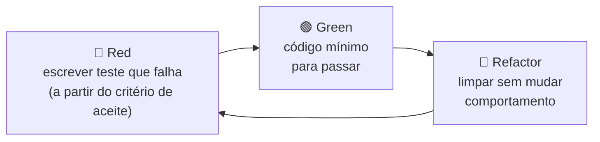

# 04 — Estratégia de Testes e TDD

## 1. Ciclo TDD adotado



**Ordem de construção (de dentro para fora):**
1. `Money` → 2. `WalletLedgerEntry` → 3. `Wallet` → 4. `WagerTransaction` → 5. `ReferencePolicy` → 6. eventos/inbox/outbox (domínio)
7. use cases com repositórios *in-memory* (testes de aplicação rápidos)
8. adapters MikroORM contra **Postgres real** (integração)
9. adapters SQS contra **LocalStack real** (integração)
10. concorrência, crash e carga (sistema completo)

> Fakes in-memory servem para dar velocidade ao TDD da camada de aplicação, **nunca** como substituto dos testes de integração. Substituir Postgres e SQS completamente por mocks é eliminatório.

## 2. Pirâmide e ferramentas

| Camada | Ferramenta | Infra | Comando | Alvo de tempo |
|---|---|---|---|---|
| Unidade | `bun test` | nenhuma | `bun run test:unit` | < 5 s |
| Integração | `bun test` + Testcontainers (`postgres:17-alpine`, `localstack/localstack:4`) | containers efêmeros | `bun run test:integration` | < 2 min |
| Concorrência / crash | `bun test` + `Bun.spawn` (N processos reais da app) | containers | `bun run test:concurrency` | < 5 min |
| E2E HTTP | `bun test` + `fetch` contra app em processo | containers | `bun run test:e2e` | < 2 min |
| Carga | k6 (via Docker) | `docker compose` com 3 instâncias | `bun run test:load` | 5–10 min |

**Regras de determinismo:**
- `Clock` e `IdGenerator` injetados. Nos testes de unidade, o relógio é fixo.
- Concorrência usa **barreira de largada** (todas as requisições disparam juntas) e asserts **apenas sobre o estado final**.
- Cada teste de integração usa um banco limpo (`TRUNCATE` via role administrativa, ou schema por teste).
- Testes de concorrência rodam 20× em loop no CI para expor flakiness.
- Invariante pós-teste (helper `assertLedgerConsistency(walletId)`), em **todos** os testes que tocam saldo:
  ```
  wallet.balance == Σ CREDIT − Σ DEBIT
  e para cada entrada n: entry[n].balance_before == entry[n-1].balance_after
  e todo lançamento tem exatamente 1 auditoria PROCESSED vinculada
  ```

## 3. Cenários — Unidade (UT)

### Money
| ID | Cenário | Esperado |
|---|---|---|
| UT-M01 | `Money.from({amount:"25.00",currency:"BRL"})` | `toString() == "25.00 BRL"`, `toJSON().amount == "25.00"` |
| UT-M02 | normalização `"25"`, `"25.5"` | `"25.00"`, `"25.50"` |
| UT-M03 | rejeita `"NaN"`, `"Infinity"`, `"1e3"`, `""`, `" 1"`, `"25.001"`, `"-1.00"`, `"1,00"` | `InvalidMoneyError` |
| UT-M04 | `0.10 + 0.20` | exatamente `"0.30"` |
| UT-M05 | `add`/`subtract` entre BRL e USD | `CurrencyMismatchError` |
| UT-M06 | imutabilidade: `a.add(b)` | `a` inalterado, nova instância |
| UT-M07 | `negate`, `isZero`, `isNegative`, `isLessThan`, `equals` | tabela verdade |
| UT-M08 | valor máximo (18 dígitos inteiros) | sem overflow (bigint) |
| UT-M09 | moeda inválida (`"BR"`, `"brl"`) | `InvalidMoneyError` |

### Wallet
| ID | Cenário | Esperado |
|---|---|---|
| UT-W01 | `open` com saldo `0` | `version 1`, sem lançamento |
| UT-W02 | `open` com saldo `100` | `version 1`, retorna lançamento `CREDIT` de abertura |
| UT-W03 | `debit` válido | saldo cai, `version+1`, entry com before/after corretos |
| UT-W04 | `debit` maior que o saldo | `InsufficientFundsError`, estado intacto |
| UT-W05 | `debit` deixando saldo exatamente `0.00` | permitido |
| UT-W06 | `credit` em moeda diferente | `CurrencyMismatchError` |
| UT-W07 | `rehydrate` com estado arbitrário | não revalida, só reconstrói |
| UT-W08 | reversão que deixaria saldo negativo | `ReversalInsufficientFundsError` (código distinto de UT-W04) |

### WagerTransaction e ReferencePolicy
| ID | Cenário | Esperado |
|---|---|---|
| UT-T01 | `create` nasce `PENDING` | status `PENDING` |
| UT-T02 | `REFUND`/`ROLLBACK` sem referência | `ReferenceRequiredError` |
| UT-T03 | `create` com kind `OPENING` via contrato externo | `OpeningNotAllowedError` |
| UT-T04 | transições válidas `PENDING→PROCESSED/REJECTED/FAILED/PENDING_REFERENCE`, `PENDING_REFERENCE→PROCESSED/REJECTED/FAILED` | ok |
| UT-T05 | qualquer transição a partir de terminal | `InvalidTransactionStateError` |
| UT-T06 | `affectsBalance()` | `false` só para `LOSS` |
| UT-T07 | `ledgerDirectionFor`: BET→DEBIT, WIN→CREDIT, REFUND→CREDIT, ROLLBACK(BET)→CREDIT, ROLLBACK(WIN)→DEBIT, ROLLBACK(REFUND)→DEBIT | tabela |
| UT-T08 | `matchesPayload` com hash igual/diferente | `true`/`false` |
| UT-T09 | hash canônico independe da ordem das chaves e do header | mesmo hash |
| UT-T10 | `REFUND` referenciando `WIN` | `REFERENCE_INVALID_KIND` |
| UT-T11 | referência de outra rodada / player / wallet / moeda / provider | `REFERENCE_MISMATCH` (5 casos) |
| UT-T12 | valor diferente da referência | `AMOUNT_MISMATCH` |
| UT-T13 | referência já revertida (por `REFUND` ou `ROLLBACK`) | `REFERENCE_ALREADY_REVERSED` |
| UT-T14 | referência `REJECTED` | `REFERENCE_NOT_PROCESSED` |
| UT-T15 | referência ainda `PENDING_REFERENCE` | dependente continua pendente |
| UT-T16 | `ReverseTransaction` com `REFUND` e com `ROLLBACK` sobre a mesma `BET` usa o mesmo fluxo (teste parametrizado por kind) | mesma validação e mesmo lançamento `CREDIT` |
| UT-T17 | segunda reversão da mesma referência | `REFERENCE_ALREADY_REVERSED` com `relatedTransactionId` da primeira |
| UT-A01 | cada transição de estado produz exatamente 1 `AuditRecord` com `from/to`, `failureCode`, `ledgerEntryId` | tabela de transições → registros |

### Ledger, Outbox, Inbox, Eventos
| ID | Cenário | Esperado |
|---|---|---|
| UT-L01 | `WalletLedgerEntry.create` com aritmética errada | erro na factory |
| UT-L02 | entry não expõe setters (checagem de tipo com `@ts-expect-error`) | compila só sem mutação |
| UT-O01 | `scheduleRetry` aplica backoff crescente com teto | sequência esperada |
| UT-O02 | `isDue(now)` | respeita `nextAttemptAt` |
| UT-E01 | `WalletBalanceChanged.toJSON()` | `eventType`/`version` vêm do tipo; `money` como string |

## 4. Cenários — Integração (IT) — Postgres e LocalStack reais

| ID | Cenário | Esperado |
|---|---|---|
| IT-01 | migrations `up` → `down` → `up` | sem erro; schema idêntico |
| IT-02 | `INSERT` com `balance < 0` direto no SQL | violação de `CHECK` |
| IT-03 | `UPDATE`/`DELETE` em `wallet_ledger_entries` | exceção do trigger |
| IT-04 | duas wallets mesmo player+moeda | violação de `UNIQUE` |
| IT-05 | ledger com aritmética inválida via SQL | violação de `CHECK` |
| IT-06 | segunda reversão `PROCESSED` da mesma referência via SQL | violação do índice parcial |
| IT-07 | atomicidade: falha forçada após gravar ledger, antes do outbox | rollback total — sem wallet alterada, sem ledger, sem outbox, sem inbox |
| IT-08 | `POST /wallets` com saldo inicial | wallet + `OPENING` + `CREDIT` na mesma transação |
| IT-09 | idempotência HTTP: mesmo request 2× | `201` e depois `200` com `idempotentReplay: true` e mesmo `balance` original |
| IT-10 | mesma key, payload diferente | `409 IDEMPOTENCY_PAYLOAD_MISMATCH`, nenhum efeito |
| IT-11 | replay de `REJECTED` | `422` idêntico, `idempotentReplay: true` |
| IT-12 | mensagem SQS processada e reentregue | 1 efeito, `duplicates_detected_total` +1, mensagem deletada |
| IT-13 | erro transitório (Postgres pausado) no consumidor | mensagem volta após backoff; ao religar, processa uma vez |
| IT-14 | payload malformado | vai para a DLQ imediatamente |
| IT-15 | erro transitório persistente | após `maxReceiveCount`, mensagem na DLQ |
| IT-16 | dois publishers sobre a mesma outbox | cada evento publicado ≥ 1×; nenhum evento perdido; duplicatas apenas se houver expiração de lease |
| IT-17 | SQS indisponível no publish | `attempts` sobe, `next_attempt_at` com backoff; publica quando volta |
| IT-18 | reinício da app com outbox pendente | eventos publicados após subir |
| IT-19 | ledger paginado | cursor estável mesmo com inserções concorrentes |
| IT-20 | reconciliação consistente e inconsistente (divergência forçada por SQL administrativo) | `consistent:false`, log `warn`, métrica `reconciliation_divergence_total` +1, **saldo não alterado** |
| IT-21 | `/health/ready` com Postgres parado | `503`; `/health/live` continua `200` |
| IT-22 | `UPDATE`/`DELETE` em `wager_transaction_audit` | exceção do trigger |
| IT-23 | linha do tempo: BET aplicada → 2 replays → 1 conflito de payload → REFUND | `GET …/audit` retorna `PROCESSED`, 2× `IDEMPOTENT_REPLAY`, `IDEMPOTENCY_CONFLICT`, `REVERSED_BY`, em ordem, com origem e `correlationId` |
| IT-24 | atomicidade da auditoria: falha forçada após gravar auditoria e antes do commit | nenhuma linha de auditoria órfã |
| IT-25 | rastreio do dinheiro: para cada lançamento do ledger existe exatamente 1 auditoria `PROCESSED` com o mesmo `ledger_entry_id` | consulta de verificação vazia |
| IT-26 | job de retenção com inbox/outbox antigas e recentes | remove só inbox processada e outbox publicada além da retenção; ledger e auditoria intactos |

## 5. Cenários — Concorrência e Crash (CT) — paralelismo real

| ID | Cenário (obrigatório §13) | Como | Esperado |
|---|---|---|---|
| CT-01 | mesma `BET` **50× em paralelo** | 50 `fetch` com barreira, mesma key | 1 `DEBIT`; 1 resposta `201` e 49 `200` com replay; saldo debitado 1× |
| CT-02 | 2× `BET 80.00` sobre `100.00` | 2 keys diferentes em paralelo | 1 `PROCESSED`, 1 `REJECTED INSUFFICIENT_FUNDS`, saldo `20.00`, 1 `DEBIT` |
| CT-03 | wallets distintas em paralelo | 20 wallets × 20 apostas | todas consistentes; tempo total ≪ serial (prova que não há lock global) |
| CT-04 | **3 instâncias** simultâneas | `Bun.spawn` de 3 processos (portas diferentes), mesmo banco; requisições distribuídas em round-robin + mensagens SQS | invariantes válidas; nenhum débito duplicado |
| CT-05 | worker morre **após commit e antes do ack** | fault injection `FAULT_CRASH_AFTER_COMMIT=1` → `process.exit(137)`; outra instância recebe a reentrega | inbox detecta; 1 efeito apenas |
| CT-06 | dois publishers na mesma outbox | 2 processos `APP_ROLE=outbox` | todos publicados; consumidor de teste deduplica por `eventId` |
| CT-07 | `ROLLBACK`/`REFUND` **antes** da referência | envia o `REFUND`, espera `202`, depois envia a `BET` | worker resolve; saldo final = inicial; eventos `PendingReference` e depois `Processed` |
| CT-08 | reinício do serviço | carga em andamento → `SIGKILL` em todas as instâncias → sobe de novo | sem mensagens perdidas, outbox drenada, invariante do ledger válida em todas as wallets |
| CT-09 | hot wallet | 200 operações mistas (BET/WIN/REFUND) na mesma wallet a partir de 3 instâncias | saldo final = cálculo esperado; sequência `wallet_version` sem buracos |
| CT-10 | reversões concorrentes da mesma `BET` | `REFUND` e `ROLLBACK` simultâneos, repetido 50× | exatamente 1 `PROCESSED`, outro `REFERENCE_ALREADY_REVERSED` apontando o vencedor; 1 `CREDIT`; auditoria da `BET` com 1 `REVERSED_BY` |
| CT-11 | `SIGTERM` com mensagem em voo | sinal durante o processamento | mensagem concluída e deletada, ou visibilidade devolvida; sem efeito duplo |

**Fault injection:** pontos nomeados (`after-commit-before-ack`, `after-commit-before-publish`, `before-commit`) ativados só quando `NODE_ENV=test`, via uma porta `FaultInjector` (no-op em produção).

## 6. Cenários — Stress / Carga (ST) — `bun run test:load`

Ferramenta: **k6** em container (gera p50/p95/p99 nativamente). Ambiente: `docker compose` com 3 réplicas da API, Postgres e LocalStack. O hardware é registrado no relatório (VM: 12 vCPU, 29 GB RAM).

| ID | Perfil | Objetivo | Métricas |
|---|---|---|---|
| ST-01 | **Baseline** — 10 VUs, 2 min, wallets distribuídas | latência de referência | throughput, p50/p95/p99, taxa de erro |
| ST-02 | **Rampa** — 10 → 200 VUs em 5 min | achar o joelho da curva | onde o p99 degrada |
| ST-03 | **Hot wallet** — 50 VUs na mesma wallet | custo da serialização por wallet | p99, `lock_timeout`, conflitos de lock |
| ST-04 | **Tempestade de duplicatas** — 30% das requisições repetidas | custo do replay | replays/s, duplicatas detectadas |
| ST-05 | **Soak** — carga moderada por 15 min | vazamento de memória/conexões, outbox lag estável | RSS, conexões do pool, outbox lag |
| ST-06 | **Fila** — 10k mensagens SQS com 3 consumidores | throughput assíncrono | msgs/s, lag, DLQ = 0 |
| ST-07 | **Caos** — derrubar 1 instância no meio do ST-02 | resiliência | erros transitórios, recuperação, invariantes |
| ST-08 | **Escala horizontal** — mesma carga (wallets distribuídas) com 1 e depois 3 instâncias | ganho real de escalar a aplicação | throughput 1× vs 3×, p95, CPU/conexões/locks do Postgres, onde satura |

**Critério de aprovação (correção, não RPS):** depois de qualquer ST, a reconciliação de **todas** as wallets retorna `consistent: true`, sem débito duplicado e com a DLQ vazia (exceto mensagens propositalmente inválidas).

**Relatório** (`docs/load-test-report.md`): ambiente, metodologia, throughput, p50/p95/p99, taxa de erro, conflitos de concorrência, outbox lag e uma análise honesta de gargalos e limitações.

## 7. Matriz de rastreabilidade (requisito obrigatório → teste)

| Requisito do enunciado (§13) | Testes |
|---|---|
| Money: escala, arredondamento, entradas inválidas | UT-M01..M09 |
| Invariantes da Wallet | UT-W01..W08 |
| Regras BET/WIN/LOSS/REFUND/ROLLBACK | UT-T06..T15, IT-08..11 |
| Conflito de moeda | UT-M05, UT-W06 |
| Key com payload divergente | UT-T08, IT-10 |
| Migrations e constraints | IT-01..06 |
| Atomicidade wallet/ledger/inbox/outbox | IT-07 |
| Inbox e redelivery | IT-12, CT-05 |
| Publishers concorrentes | IT-16, CT-06 |
| Retry e DLQ | IT-13..15 |
| Recuperação após reinício | IT-18, CT-08 |
| 50× paralelo | CT-01 |
| Saldo disputado | CT-02 |
| Wallets distintas | CT-03 |
| ≥ 3 instâncias | CT-04 |
| Crash após commit / antes do ack | CT-05 |
| Referência fora de ordem | CT-07 |
| Reinício com consistência final | CT-08 |
| Auditoria completa (decisão D-18) | UT-A01, IT-22..25, CT-10 |
