# 05 — Diagramas

> Diagramas em Mermaid; o GitHub e o VS Code (extensão *Markdown Preview Mermaid Support*) renderizam direto.

## 1. Contexto (C4 nível 1)

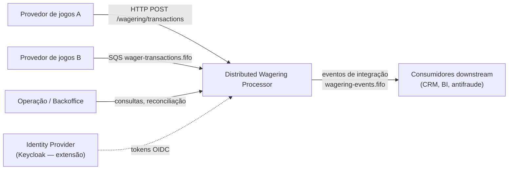

## 2. Implantação local (Docker Compose)

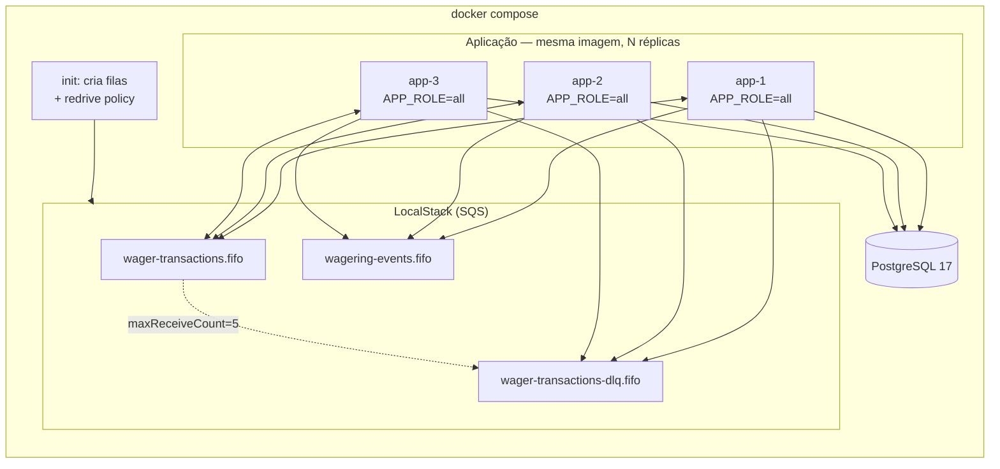

## 3. Componentes (hexagonal)

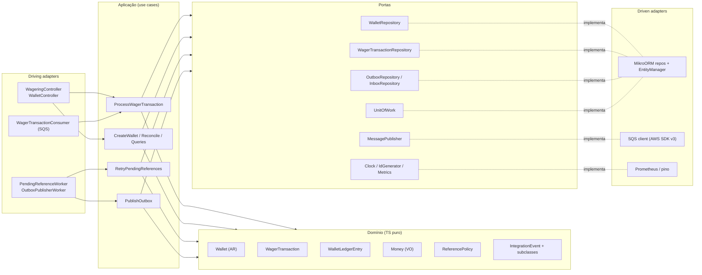

## 4. Modelo de dados (ER)

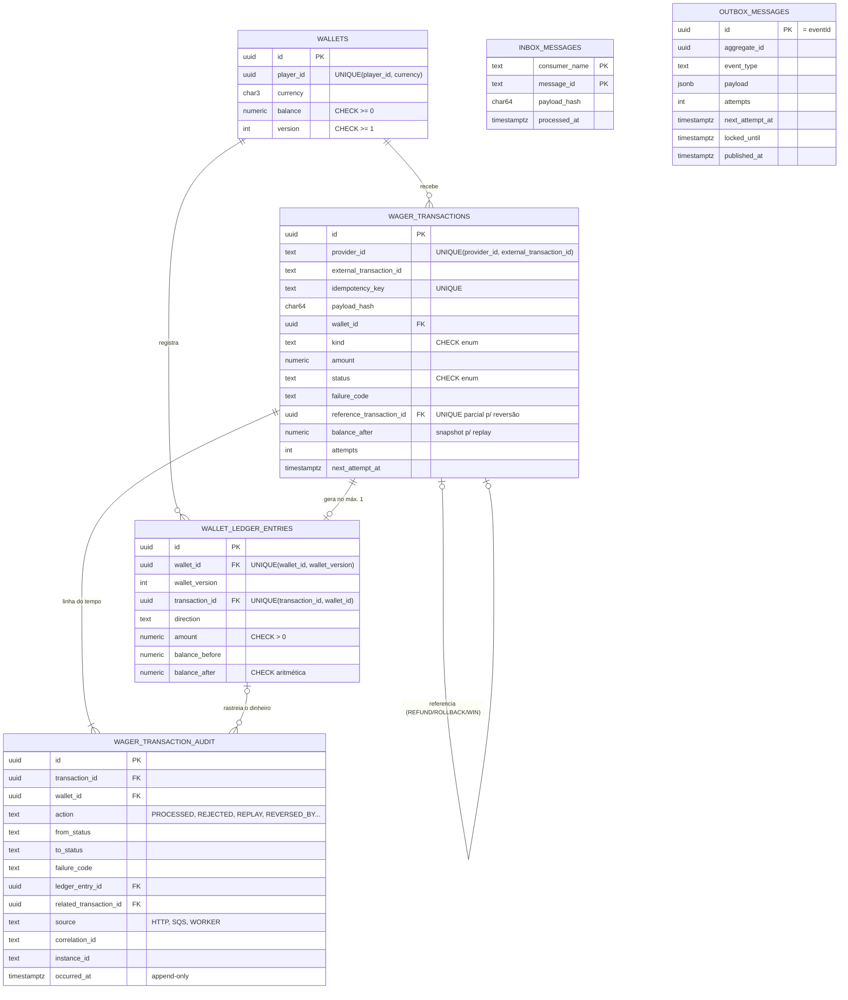

## 5. Máquina de estados — `WagerTransaction`

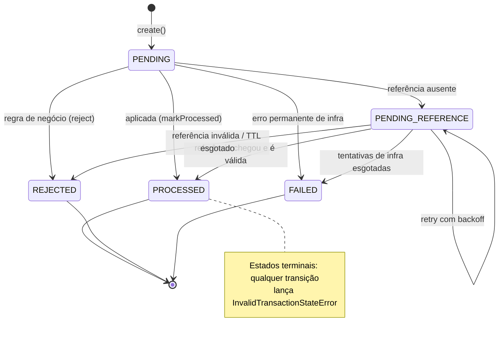

> `PENDING` é transitório **dentro** da transação SQL: na prática, uma transação recém-criada é persistida já em `PROCESSED`, `REJECTED` ou `PENDING_REFERENCE`.

## 6. Sequência — submissão HTTP (caminho feliz + idempotência)

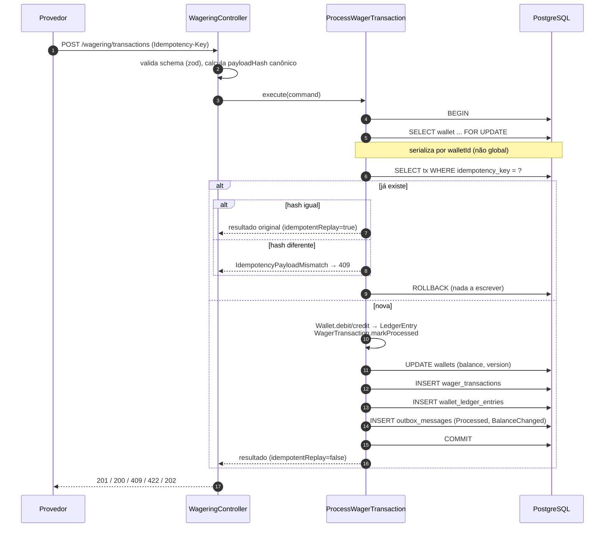

## 7. Cenário obrigatório — duas apostas concorrentes

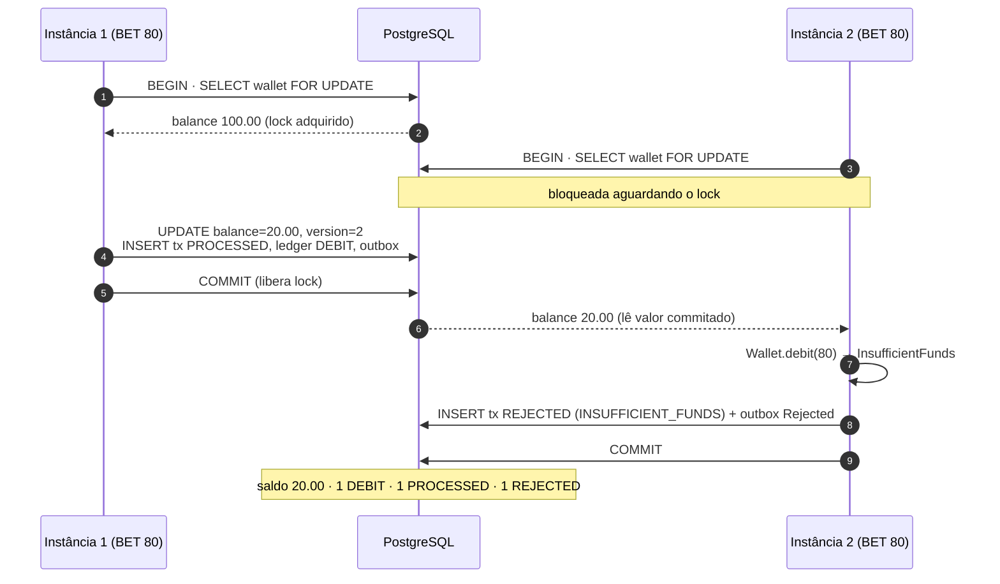

## 8. Sequência — consumo SQS com inbox

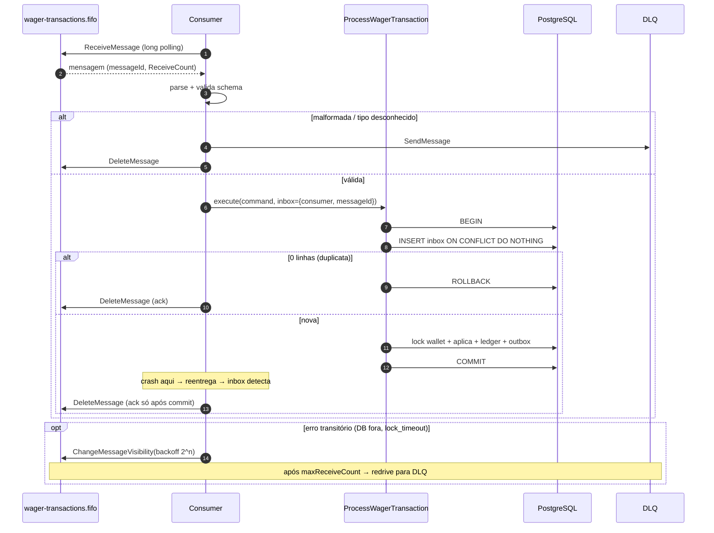

## 9. Sequência — Transactional Outbox com crash

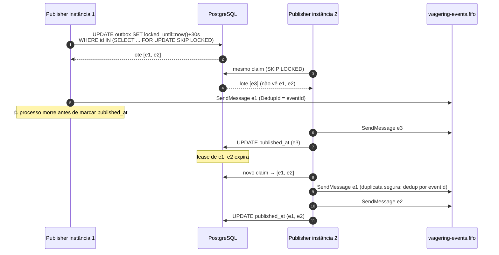

## 10. Sequência — referência fora de ordem

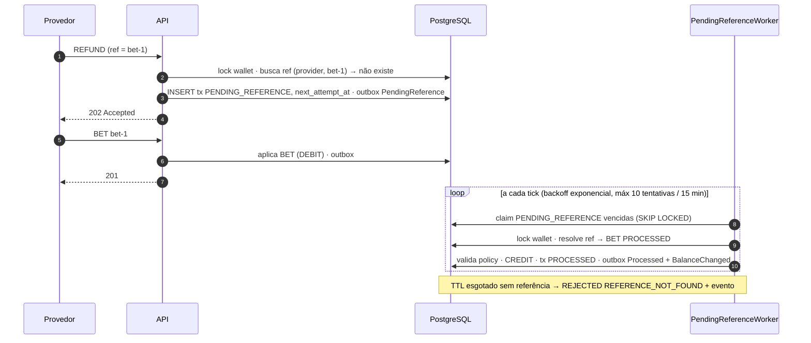

## 11. Decisão — classificação de erro no consumidor

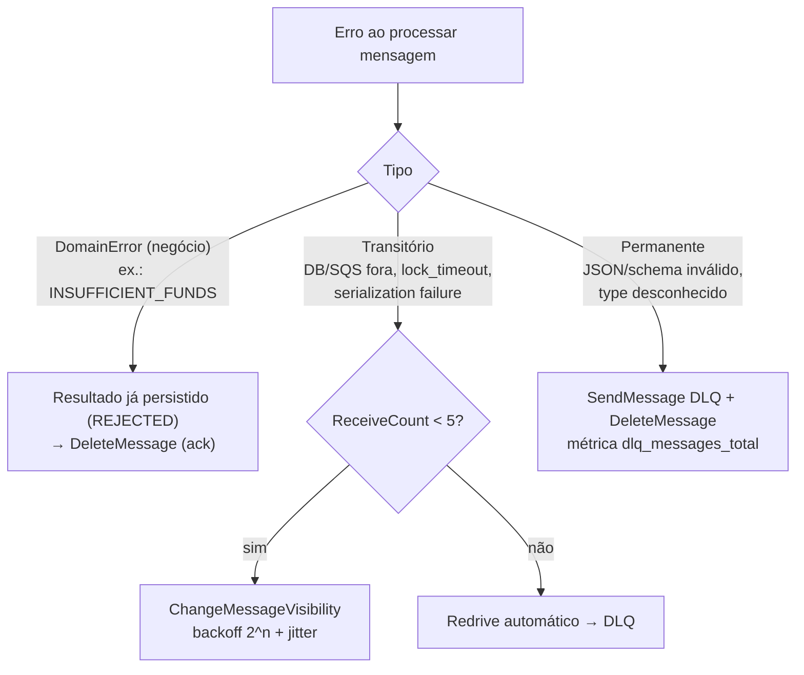

## 12. Fluxo único de reversão (`REFUND` e `ROLLBACK`)

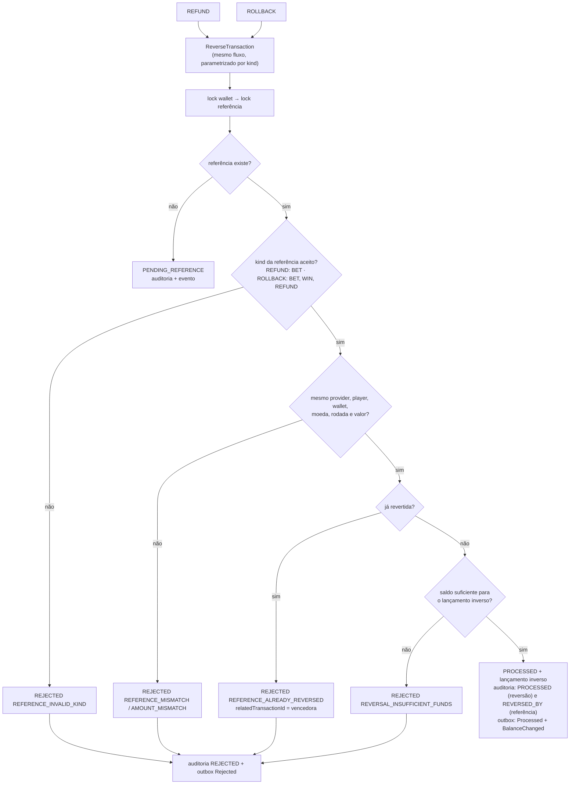

## 13. Linha do tempo de auditoria (exemplo)

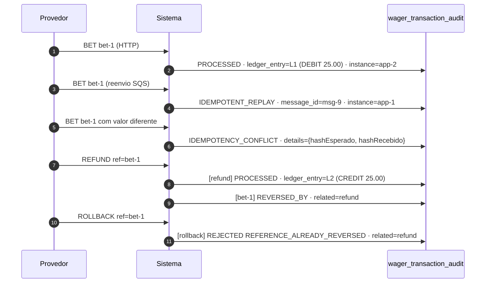
