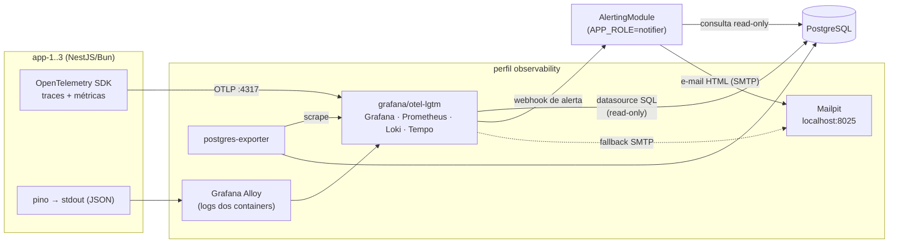
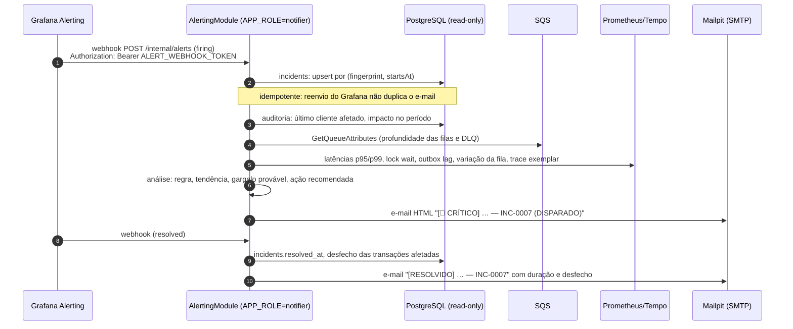

# 06 — Observabilidade (100% gratuita e local)

## 0. O que está implementado (fim da Iteração 8)

| Peça | Situação |
|---|---|
| Logs JSON (pino) com `correlationId`, `messageId`, `transactionId`, `walletId`, `providerId` e mascaramento | ✅ (obrigatório §12) |
| Métricas Prometheus em `/metrics` por instância (§3) | ✅ (obrigatório §12) |
| Health `live` / `ready` | ✅ (obrigatório §12) |
| Perfil `observability`: Prometheus (descobre cada réplica pelo DNS), `postgres-exporter`, Grafana com fonte Prometheus e PostgreSQL **somente leitura** | ✅ diferencial |
| Dashboards "Operação" e "Auditoria financeira" provisionados (§6) | ✅ diferencial |
| 14 alertas por severidade com e-mail no Mailpit e políticas de reenvio (§7) | ✅ diferencial |
| OpenTelemetry (traces, §4) | ➖ não implementado: o SDK tem suporte parcial no Bun; as métricas e os logs correlacionados cobrem o §12 |
| Relatório de incidente enriquecido por e-mail (§8: análise, último cliente, gargalo) | ➖ desenho pronto, não implementado; hoje o e-mail é o template nativo do Grafana com o resumo do alerta |

```bash
docker compose --profile observability up -d
# Grafana   http://localhost:3001  (admin/admin; leitura anônima liberada)
# Mailpit   http://localhost:8025  (e-mails de alerta)
# Prometheus http://localhost:9090/targets  (uma linha por réplica)
```

## 1. Requisitos

- **Gratuito e open source:** o repositório é público. Quem clonar precisa rodar tudo sem conta, sem chave e sem cartão.
- **Nenhum segredo no git:** tokens de notificação só via `.env` (ignorado pelo git); o repositório traz `.env.example`.
- Responder em tempo real, sem abrir o banco:

| Pergunta | Fonte |
|---|---|
| Quantos `ROLLBACK` e `REFUND` ocorreram, e com qual resultado? | métrica `reversals_total` + SQL na auditoria |
| Quantas duplicatas houve (replay, conflito, reentrega SQS, republicação de evento)? | métrica `duplicates_detected_total` |
| Quais erros, de que categoria e com qual `failureCode`? | métrica `errors_total` + logs |
| Quanto dinheiro se moveu e quantos lançamentos? | SQL no ledger (exato) + métrica `ledger_entries_total` |
| O banco está sofrendo? (locks, deadlocks, queries lentas, conexões) | `postgres-exporter` + `pg_stat_statements` |
| Onde o código gasta tempo e onde falha? | traces por use case |

> **Métrica ≠ auditoria.** As métricas servem para a visão operacional (agregadas, com retenção limitada). A **verdade** está no banco: ledger + `wager_transaction_audit` (D-18). O dashboard mostra as duas coisas, mas nada nele corrige saldo.

## 2. Stack

| Peça | Ferramenta (open source) | Papel |
|---|---|---|
| Instrumentação | **OpenTelemetry SDK** | traces + métricas, sem dependência de fornecedor |
| Logs | **pino** (JSON em stdout) | logs estruturados com `trace_id` |
| Backend de observabilidade | **`grafana/otel-lgtm`** (1 container) | Grafana + Prometheus (métricas) + Loki (logs) + Tempo (traces) + coletor OTel |
| Coleta de logs dos containers | **Grafana Alloy** | lê os logs do Docker e envia ao Loki |
| Métricas do banco | **`postgres-exporter`** | TPS, locks, deadlocks, conexões, tamanho de tabelas |
| Dados exatos | Grafana com fonte **PostgreSQL** (usuário somente leitura) | painéis com SQL sobre o ledger e a auditoria |
| Alertas | **Grafana Alerting** | regras provisionadas como código; detecção e agrupamento |
| Relatório de incidente | **módulo `alerting`** da aplicação + SMTP (nodemailer) | enriquece o alerta com análise, cliente afetado, gargalo e filas (§8) |
| E-mail local | **Mailpit** | caixa de entrada web para ver os alertas sem serviço externo |



```bash
docker compose --profile observability up -d
# Grafana:  http://localhost:3001  (dashboards e alertas já provisionados)
# Mailpit:  http://localhost:8025  (e-mails de alerta)
```

## 3. Catálogo de métricas

> **Prioridade:** as métricas exigidas pelo §12 (transações por status, duplicatas, retries, DLQ, conflitos de lock, outbox lag, latência) são **obrigatórias** e nascem junto com cada peça (I3 a I5), expostas em `/metrics`. Grafana, alertas e e-mail (§6 a §8 deste documento) são **diferenciais** da I8.

Prefixo `wagering_`. **As tags nunca incluem** `walletId`, `playerId`, `transactionId` nem valores (por cardinalidade e privacidade). Esses campos ficam só em logs e traces.

| Métrica | Tipo | Tags | Responde |
|---|---|---|---|
| `wager_transactions_total` | counter | `kind`, `status`, `failure_code`, `source` (http/sqs/worker) | volume por tipo e resultado |
| `reversals_total` | counter | `kind` (refund/rollback), `reference_kind`, `outcome` (processed/already_reversed/insufficient_funds/mismatch/pending) | ocorrências de rollback e refund |
| `duplicates_detected_total` | counter | `source`, `type` (idempotent_replay/payload_conflict/key_mismatch/inbox_duplicate/outbox_republish) | duplicatas e de onde vêm |
| `errors_total` | counter | `category` (validation/business/transient/permanent), `failure_code`, `component` | erros classificados |
| `ledger_entries_total` | counter | `direction`, `kind` | movimentações no banco |
| `pending_references` | gauge | — | backlog de referências fora de ordem |
| `pending_reference_resolution_seconds` | histogram | `outcome` | quanto tempo a referência demorou |
| `dlq_messages_total` | counter | `reason` | mensagens enviadas à DLQ |
| `retries_total` | counter | `component` (consumer/outbox/pending_worker) | retries |
| `lock_wait_seconds` | histogram | — | espera pelo lock da wallet |
| `lock_timeouts_total` | counter | — | contenção extrema (hot wallet) |
| `outbox_lag_seconds` | gauge | — | idade do evento pendente mais antigo |
| `processing_duration_seconds` | histogram | `kind`, `source`, `status` | latência ponta a ponta |
| `reconciliation_divergence_total` | counter | — | divergência saldo × ledger (**deve ser 0**) |
| `queue_depth` | gauge | `queue` | mensagens visíveis + em voo (via `GetQueueAttributes` a cada 15 s), base do alerta de aumento de fila |
| `queue_wait_seconds` | histogram | `queue` | tempo entre o envio (`SentTimestamp`) e o consumo, ou seja, o atraso na fila |
| `consumer_utilization` | gauge | — | fração dos slots de consumo ocupados (consumo parado × capacidade insuficiente) |
| `db_pool_in_use` | gauge | — | conexões em uso no pool (saturação do banco) |

**Coleta por instância:** cada réplica expõe seus próprios contadores em `/metrics`. O Prometheus deve coletar cada instância (no Compose, via DNS do serviço `app`), nunca pelo balanceador — por ele, cada coleta cai numa réplica diferente (ADR-28).

O volume financeiro (soma de valores) **não** vira métrica, porque métricas usam ponto flutuante. Ele vem de SQL exato sobre o ledger (§6).

## 4. Traces (código)

Um trace por requisição ou mensagem, com spans nomeados:

```
POST /wagering/transactions
 └─ ProcessWagerTransaction            (kind, source, outcome)
     ├─ db.lock_wallet                 (lock_wait_ms)
     ├─ db.find_by_idempotency_key
     ├─ domain.apply / domain.reverse
     ├─ db.persist (tx, ledger, audit, outbox)
     └─ db.commit
OutboxPublisher.publishBatch
 └─ sqs.SendMessage                    (event_type, attempt)
```

O `trace_id` vai nos logs. No Grafana, um log de erro abre o trace correspondente (Loki ↔ Tempo).

## 5. Logs

- JSON (pino) com `service`, `env`, `version`, `instance_id`, `correlationId`, `messageId`, `transactionId`, `walletId`, `providerId`, `kind`, `status`, `failureCode`, `trace_id`.
- **Redaction:** sem valores monetários completos, sem payload bruto, sem headers de autenticação.
- Docker via **snap**: o Alloy lê os logs pela API do Docker (`/var/run/docker.sock`), sem depender do caminho físico dos arquivos de log.

## 6. Dashboards (provisionados como código em `observability/grafana/`)

**"Wagering — Operação"** (métricas, tempo real):
1. Transações/s por `kind` e `status`
2. Reversões: refund × rollback × resultado
3. Duplicatas por tipo e origem
4. Erros por categoria e `failure_code` (top 10)
5. Lançamentos no ledger por direção
6. Latência p50/p95/p99 por `kind`
7. Banco: lock wait, lock timeouts, deadlocks, conexões, queries mais lentas
8. Mensageria: outbox lag, pendências de referência, DLQ

**"Wagering — Auditoria financeira"** (SQL exato, fonte PostgreSQL somente leitura):
1. Volume creditado e debitado por dia e moeda (`SUM` em `NUMERIC`, sem arredondamento)
2. Reversões por tipo e resultado
3. Rejeições por `failureCode`
4. Linha do tempo de uma transação (variável `transactionId` no painel)
5. Reconciliação: wallets cujo saldo ≠ ledger (**tabela vazia = saudável**)
6. Antifraude: jogadores com reversões em excesso e com apostas em jogos simultâneos

Os alertas antifraude **não bloqueiam** transações (D-19): sinalizam para análise humana. O jogador aparece mascarado no e-mail.

```sql
-- reversões por tipo e resultado no período do painel
SELECT t.kind, a.action, a.failure_code, count(*)
FROM wager_transaction_audit a
JOIN wager_transactions t ON t.id = a.transaction_id
WHERE t.kind IN ('REFUND','ROLLBACK') AND $__timeFilter(a.occurred_at)
GROUP BY 1,2,3 ORDER BY 4 DESC;

-- antifraude: jogadores com apostas em mais de um jogo dentro de 2 minutos
SELECT t1.player_id, count(DISTINCT t2.game_id) AS jogos
FROM wager_transactions t1
JOIN wager_transactions t2
  ON t2.player_id = t1.player_id AND t2.kind = 'BET' AND t2.status = 'PROCESSED'
 AND t2.created_at BETWEEN t1.created_at - interval '2 minutes' AND t1.created_at + interval '2 minutes'
WHERE t1.kind = 'BET' AND t1.status = 'PROCESSED' AND $__timeFilter(t1.created_at)
GROUP BY t1.player_id HAVING count(DISTINCT t2.game_id) > 1;

-- wallets inconsistentes (deve retornar zero linhas)
SELECT w.id, w.balance,
       COALESCE(SUM(CASE l.direction WHEN 'CREDIT' THEN l.amount ELSE -l.amount END), 0) AS ledger_balance
FROM wallets w LEFT JOIN wallet_ledger_entries l ON l.wallet_id = w.id
GROUP BY w.id, w.balance
HAVING w.balance <> COALESCE(SUM(CASE l.direction WHEN 'CREDIT' THEN l.amount ELSE -l.amount END), 0);
```

## 7. Alertas por severidade (`observability/grafana/alerting/`)

Três níveis, cada um com uma política de envio diferente para evitar fadiga de alerta:

| Nível | Significado | Envio | Reenvio enquanto ativo |
|---|---|---|---|
| 🔴 **Crítico** | risco financeiro ou serviço parado | imediato (~10 s) | a cada 30 min |
| 🟠 **Médio** | degradação ou exige ação operacional | imediato (~30 s) | a cada 2 h |
| 🟢 **Leve** | anomalia sem impacto imediato | imediato (~1 min) | a cada 1 h |

> **Todo alerta novo avisa na primeira ocorrência**; a severidade só define a frequência de
> reenvio enquanto ele continua ativo. A versão anterior mandava os leves num *resumo horário*
> agrupado por severidade: um alerta leve novo, que entrava num grupo já aberto, podia esperar
> até 1 h — a suíte de evidências (cenário A07) pegou isso. Agrupamento atual:
> `[alertname, severity]` (`provisioning/alerting/contact-points.yml`).

| Alerta | Condição | Nível |
|---|---|---|
| Divergência de reconciliação | `reconciliation_divergence_total` > 0 **ou** a consulta de wallets inconsistentes retorna linhas | 🔴 crítico |
| Banco indisponível | `/health/ready` falhando por Postgres em ≥ 2 instâncias por 1 min | 🔴 crítico |
| Outbox parada | `outbox_lag_seconds` > 300 | 🔴 crítico |
| **Aumento de fila** (forte) | `queue_depth{queue="wager-transactions"}` cresce por 10 min **e** > 1.000 | 🔴 crítico |
| DLQ recebendo | `dlq_messages_total` aumentou **ou** `queue_depth{queue="wager_dlq"}` > 0 (a profundidade vê também o redrive feito pelo SQS; o alerta fica ativo até a DLQ ser tratada) | 🟠 médio |
| Reversão sem saldo | `reversals_total{outcome="insufficient_funds"}` > 0 | 🟠 médio |
| **Atraso** de processamento | p95 de `processing_duration_seconds` > 1 s por 5 min | 🟠 médio |
| **Atraso** na fila | p95 de `queue_wait_seconds` > 30 s por 5 min | 🟠 médio |
| **Gargalo**: hot wallet | `lock_timeouts_total` > 0 **ou** p95 de `lock_wait_seconds` > 200 ms | 🟠 médio |
| Outbox atrasada | `outbox_lag_seconds` > 30 por 5 min | 🟠 médio |
| **Aumento de fila** (moderado) | `deriv(queue_depth[10m]) > 0` por 10 min | 🟠 médio |
| Conflito de idempotência anormal | taxa de `payload_conflict` > 1% | 🟢 leve |
| Referências pendentes acumulando | `pending_references` > 100 por 5 min | 🟢 leve |
| Retries elevados | `retries_total` > 2× a média da última hora | 🟢 leve |
| **Antifraude**: velocidade de reversões | um jogador com mais de 5 `REFUND`/`ROLLBACK` processados na última 1 h (SQL na auditoria) | 🟠 médio |
| **Antifraude**: jogos simultâneos | um jogador com `BET` em mais de 1 `gameId` dentro de 2 min (SQL) | 🟠 médio |

## 8. Relatório de incidente por e-mail

### 8.1 Fluxo



- **Detecção** fica no Grafana (não reimplementamos avaliação de regras, agrupamento e silenciamento).
- **Enriquecimento e redação** ficam na aplicação, que conhece o domínio (auditoria, ledger, filas).
- O notificador roda com papel próprio (`APP_ROLE=notifier`) e usa um usuário de banco **somente leitura**, exceto na tabela `incidents`. Uma falha nele **nunca** afeta o processamento financeiro.
- **Fallback:** se o webhook da aplicação falhar, o Grafana envia direto ao Mailpit um e-mail simples (template nativo), para que o alerta nunca se perca.

### 8.2 Conteúdo do e-mail

**Assunto:** `[🔴 CRÍTICO] Aumento de fila em wager-transactions.fifo — INC-0007 (DISPARADO)`

| Seção | Conteúdo | Fonte |
|---|---|---|
| **Resumo** | alerta, nível, status (DISPARADO / RESOLVIDO), início, duração, ambiente, instâncias envolvidas | Grafana + `incidents` |
| **Análise do ocorrido** | regra violada, valor observado × limite, tendência nos últimos 15 min, outros alertas ativos correlacionados e uma conclusão em texto (ex.: "fila crescendo porque o p95 do lock da wallet subiu 8×: hot wallet") | Prometheus + regras de diagnóstico |
| **Último cliente afetado** | `walletId`, `playerId` **mascarado** (`0192f28f…f4a1`), `providerId`, `transactionId`, `kind`, `status`/`failureCode`, horário e link para a linha do tempo no dashboard de auditoria | `wager_transaction_audit` |
| **Impacto** | nº de transações, wallets e provedores afetados no período; nº de rejeições por `failureCode` | auditoria |
| **Atraso** | p95/p99 de processamento, p95 de espera na fila, outbox lag, idade da referência pendente mais antiga | Prometheus |
| **Gargalo provável** | componente dominante entre lock da wallet, queries no banco, publicação SQS e saturação do consumidor, com evidência (ex.: "lock wait = 78% do tempo; wallets com maior volume: …") e link para um trace exemplar | Prometheus + Tempo + auditoria |
| **Filas** | profundidade atual de `wager-transactions`, DLQ e `wagering-events`, mensagens em voo, variação (+% em 15 min) e taxa de entrada × saída | SQS + Prometheus |
| **Desfecho** | *Disparado:* o que aconteceu com a transação do último cliente (aplicada, rejeitada, em retry, na DLQ) e se há recuperação automática em curso. *Resolvido:* duração total, como se resolveu (automática ou manual) e o estado final das transações afetadas | auditoria + `incidents` |
| **Ação recomendada** | passos do runbook do alerta (`docs/runbooks/<alerta>.md`) | repositório |
| **Links** | dashboard filtrado no período, trace exemplar, linha do tempo do cliente | Grafana |

**Privacidade:** o `playerId` vai mascarado e o e-mail não leva valores monetários nem payloads. O detalhe completo fica no dashboard de auditoria, que exige acesso ao Grafana.

### 8.3 Regras de diagnóstico do gargalo

Heurísticas determinísticas, testáveis, sem "IA":

| Sinal dominante | Conclusão no e-mail |
|---|---|
| `lock_wait` p95 alto + poucas wallets concentrando o volume | **hot wallet** (lista as wallets de maior volume) |
| duração de query alta + conexões do pool esgotadas | **banco saturado** (pool ou queries lentas; top queries do `pg_stat_statements`) |
| `queue_depth` subindo + consumidores ociosos | **consumo parado** (instâncias `consumer` fora do ar?) |
| `queue_depth` subindo + consumidores a 100% | **capacidade insuficiente** (escalar `consumer`) |
| `outbox_lag` alto + erros de publicação | **SQS indisponível** para publicação |
| nenhum sinal dominante | "sem gargalo identificado", com as métricas brutas |

### 8.4 Persistência dos incidentes

```sql
CREATE TABLE incidents (
  id            bigserial PRIMARY KEY,               -- INC-0007
  fingerprint   text NOT NULL,                       -- do Grafana
  alert_name    text NOT NULL,
  severity      text NOT NULL CHECK (severity IN ('CRITICAL','MEDIUM','LOW')),
  status        text NOT NULL CHECK (status IN ('FIRING','RESOLVED')),
  started_at    timestamptz NOT NULL,
  resolved_at   timestamptz,
  last_report   jsonb NOT NULL,                      -- snapshot do último relatório enviado
  emails_sent   integer NOT NULL DEFAULT 0,
  CONSTRAINT uq_incident UNIQUE (fingerprint, started_at)
);
```

Isso dá histórico de incidentes (e um painel "Incidentes" no Grafana) e idempotência: o mesmo disparo reenviado pelo Grafana não gera um e-mail duplicado.

### 8.5 Canais

| Canal | Padrão? | Configuração |
|---|---|---|
| E-mail via **Mailpit** (`localhost:8025`) | ✅ | nada; funciona logo após o clone |
| E-mail via SMTP real (ex.: Gmail com senha de app) | opcional | `SMTP_HOST`, `SMTP_PORT`, `SMTP_USER`, `SMTP_PASSWORD`, `ALERT_EMAIL_TO` no `.env` |

O `.env` está no `.gitignore`. O `.env.example` documenta as chaves sem valores.

### 8.6 Testes

| ID | Cenário | Esperado |
|---|---|---|
| UT-N01 | gerar o relatório a partir de fixtures (alerta + métricas + auditoria) | HTML com todas as seções; `playerId` mascarado; sem valores monetários |
| UT-N02 | regras de diagnóstico (tabela §8.3) | conclusão esperada para cada combinação de sinais |
| UT-N03 | escaping HTML de campos vindos do provedor (`roundId`, `gameId`) | sem injeção no e-mail |
| IT-N01 | webhook `firing` → e-mail no Mailpit (consultado pela API `GET /api/v1/messages`) | 1 e-mail, assunto com nível e INC |
| IT-N02 | mesmo webhook 3× | 1 e-mail (idempotência por fingerprint) |
| IT-N03 | `resolved` | e-mail de desfecho com duração |
| IT-N04 | alertas leves | consolidados num único e-mail por hora |
| IT-N05 | notificador fora do ar | Grafana envia o e-mail simples de fallback |
| E2E-N01 | forçar mensagem na DLQ com 3 instâncias rodando | e-mail 🟠 "DLQ recebendo" com o último cliente e o desfecho "mensagem na DLQ" |
| E2E-N02 | gerar carga numa hot wallet (ST-03) | e-mail 🟠 com o gargalo "hot wallet" identificando a wallet |

## 9. Alternativas descartadas

| Alternativa | Motivo |
|---|---|
| Datadog | pago após o trial e exige conta; quem clonar o repositório não conseguiria rodar |
| Dashboard próprio (página web) | reimplementaria armazenamento temporal, percentis, alertas e silenciamento, com resultado inferior e sem pontuar no desafio |
| Notificador próprio fazendo a **detecção** | o Grafana já avalia regras, agrupa e silencia; a aplicação só enriquece e redige |
| E-mail só com o template nativo do Grafana | não tem acesso ao domínio (último cliente, desfecho, gargalo); fica apenas como fallback |
| Prometheus + Alertmanager avulsos | mais containers e configuração; o `otel-lgtm` + Grafana Alerting cobrem o mesmo |
